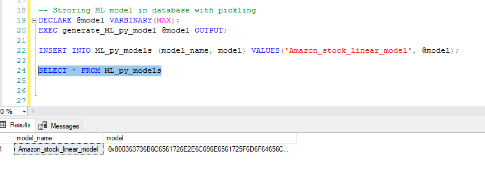
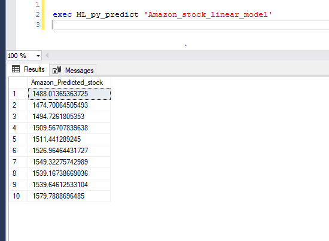

### Microsoft SQL Server + Machine Learning: 

Microsoft has been always known as a company which walks with the Era, because they develop significantly remarkable products with extensive features, like Power BI for Reporting, SQL Server Database and SSDT (SQL Server Data Tools). 

Microsoft SQL Server has recently introduced support for Python and R for Data Science and ML Modeling in SQL Server 2017 version and continuously developing support for all the Python and R language. 

Which can be used to provide advanced analytics solution to modern business problems like  

    * Fraud detection for credit cards 

    * Product recommendation for Customer Experience Improvement (CEP) 

    * Advance product promotion analysis 

    * Generating Predictive Analysis and Reports for Business 

### Prerequisites 

    SQL server 2017  

### Let’s Start: 

To start creating ML Modeling in SQL Server, we will require Python and R support, which needs to be installed while setting up SQL Server installation. 

If Python support is not installed, we have to install it with SQL Server installation. 

To verify, if Python is present, we need to run the below script in SSMS query window. 

Enable external script in sp_congigure 

    EXEC sp_configure "external scripts enabled", 1 

    RECONFIGURE WITH OVERRIDE; 

Script to test python on SQL server 

    EXECUTE sp_execute_external_script 

        @language =N'Python', 

        @script=N'
    import sys 
    p = "python version" 
    print( p , sys.version) 
    print("Hellow from the SQL server")'; 

    GO

Now we have Python 3.5.2 version in our SQL Server. 

Microsoft SQL Server provides Continuum Analytics Python package which includes several different Python models for Data Science and Advanced Analytics like Pandas, Sklearn, Numpy etc. 

Note: Make sure SQL Server Launchpad services are up and running, because Launchpad service are required to execute external scripts (Python or R). 

#### Step 1:  Creating Table for Model storage 

First, we need to create a table which will be saving the data of machine learning trained model, so that one-time trained model can be used multiple times and it is re-usable. 

Note: When complex algorithms are used because of huge data, it is a best practice to save our trained models, since it saves our time. 

Code:  To create ML Model tables in SQL Server. 

    CREATE TABLE ML_py_models ( 

    model_name VARCHAR(30) NOT NULL DEFAULT('default model') PRIMARY KEY, 

    model VARBINARY(MAX) NOT NULL 

    ); 

    GO 

#### Step 2: SP to Creating and training ML Model   

Create a custom SP (Stored Procedure), which will create a model and return a pickle file to save in SQL Server table. 

The ML model which we are creating, will use Amazon stock data and predict stock price 10 days into the future.   

Code to create Stored Procedure: 

    CREATE PROCEDURE generate_ML_py_model (@trained_model varbinary(max) OUTPUT) 

    AS 

    BEGIN 

    EXECUTE sp_execute_external_script 

    @language = N'Python' 

    , @script = N' 

    from pandas import read_csv, DataFrame 

    from sklearn.linear_model import LinearRegression  

    #import matplotlib.pyplot as plt 

    #import quandl 

    from sklearn import preprocessing, cross_validation 

    import numpy as np 

    import pickle 

    data = read_csv("E:\\amazon_data.csv") 

    forcast = int(10) 

    data = data[["Adj. Close"]] 

    data["prediction"] = data[["Adj. Close"]].shift(-forcast) 

    feature = np.array(data.drop(["prediction"],1)) 

    #feature = np.array(data["Adj. Close"]) 

    label = np.array(data["prediction"]) 

    X = preprocessing.scale(feature) 

    y = label[:-forcast] 

    forcast_value = X[-forcast:] 

    X= X[:-forcast] 

    X_train, X_test, y_train, y_test = cross_validation.train_test_split(X,y, test_size =0.2) 

    lr = LinearRegression() 

    lr.fit(X_train, y_train) 

    #Before saving the model to the DB table, we need to convert it to a binary object 

    trained_model = pickle.dumps(lr)' 

    , @input_data_1 = N'' 

    , @input_data_1_name = N'' 

    , @params = N'@trained_model varbinary(max) OUTPUT' 

    , @trained_model = @trained_model OUTPUT; 

    END; 

    GO 

Developing custom SPs are also possible for different parameter like features and label’s according to the Dataset and creating different ML models with several other machine learning algorithms. 

These different models can be saved with pickling and used later. 

#### Step 3: Saving trained model into Table 

The Stored Procedure which was created earlier is used to train the ML model and save it into the table ML_py_models.  

#### Step 4: Stored procedure to use the trained model 

Create a custom SP which will use these trained models and gives the expected output. 

Code to Create SP, which will use the trained model and gives the prediction. 

    CREATE PROCEDURE ML_py_predict (@model varchar(100)) 

    AS 

    BEGIN 

    DECLARE @py_model varbinary(max) = (select model from ML_py_models where model_name = @model); 

    EXEC sp_execute_external_script 

            @language = N'Python', 

            @script = N' 

    import pickle 

    from pandas import read_csv, DataFrame 

    from sklearn.linear_model import LinearRegression  

    from sklearn import preprocessing, cross_validation 

    import numpy as np 

    

    data = read_csv("E:\\amazon_data.csv") 

    forcast = int(10) 

    data = data[["Adj. Close"]] 

    data["prediction"] = data[["Adj. Close"]].shift(-forcast) 

    feature = np.array(data.drop(["prediction"],1)) 

    X = preprocessing.scale(feature) 

    forcast_value = X[-forcast:] 

    X= X[:-forcast] 

    lr = pickle.loads(py_model) 

    predictions = lr.predict(forcast_value) 

    df = DataFrame({"Amazon_Predicted_stock": predictions}) 

    OutputDataSet = df 

    print(df)' 

    , @input_data_1 = N'' 

    , @input_data_1_name = N'' 

    , @params = N'@py_model varbinary(max)' 

    , @py_model = @py_model 

    with result sets (("Amazon_Predicted_stock" float)); 

    END; 

    GO 

#### Step 5: Usage of the Model 

The SP will use the model through which you can see the expected output.  

As our model was designed to predict stocks for 10 days in the future, we are getting 10 consecutive values respectively. 

This output result set can be used to generate predictive report for business people for different use case. 

This is a simple example of using SQL Server Advanced Analytics with Python. We can develop more usable and custom Stored Procedure for creating and training ML models to solve different business requirement and needs. 

 

### Conclusion: 

As Data Science and Machine Learning are emerging technologies in today’s Era, every business wants to get maximum ROI (Return on Investments) by using Advanced Analytics. Microsoft is focusing on providing best solution for their current products like Power BI, SQL Server and SSDT tools to make BI (Business Intelligence) more efficient and effective. 

Microsoft is continuously enhancing SQL server capabilities in preview of SQL server 2019 version Microsoft providing support for HDFS and Spark frame work support for simplifying big data analytics for SQL server users. 